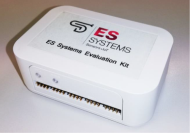
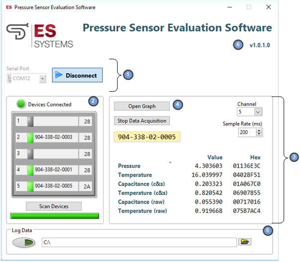
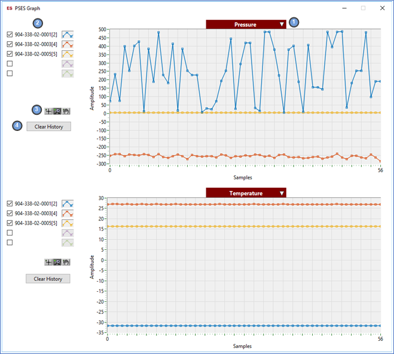
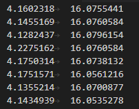

<table>
<colgroup>
<col style="width: 21%" />
<col style="width: 78%" />
</colgroup>
<thead>
<tr class="header">
<th colspan="2"><blockquote>

ESCP-BMS1 Evaluation Software Manual

</blockquote></th>
</tr>
</thead>
<tbody>
<tr class="odd">
<td><blockquote>

Title

</blockquote></td>
<td><blockquote>

ESCP-BMS1 Evaluation Software Manual

</blockquote></td>
</tr>
<tr class="even">
<td><blockquote>

Doc Ref

</blockquote></td>
<td><blockquote>

ESS-243/080120/EXC-REV.02

</blockquote></td>
</tr>
</tbody>
</table>

**DOCUMENT TRACKING TABLE**

<table>
<colgroup>
<col style="width: 18%" />
<col style="width: 18%" />
<col style="width: 63%" />
</colgroup>
<thead>
<tr class="header">
<th><blockquote>

Version

</blockquote></th>
<th><blockquote>

Date

</blockquote></th>
<th><blockquote>

Reason for change

</blockquote></th>
</tr>
</thead>
<tbody>
<tr class="odd">
<td><blockquote>

1

</blockquote></td>
<td><blockquote>

30/7/2019

</blockquote></td>
<td><blockquote>

Initial version

</blockquote></td>
</tr>
<tr class="even">
<td><blockquote>

2

</blockquote></td>
<td><blockquote>

26/10/2022

</blockquote></td>
<td><blockquote>

Cosmetic &amp; installation instructions corrected

</blockquote></td>
</tr>
</tbody>
</table>

# Data Readout GUI

## Software Installation

To install the Pressure Sensor Evaluation Software:

- Run setup.exe (as administrator if possible) and follow the
  installation wizard.

- Once the installation is complete run PSES.exe

## Application Description

| **\#** | **Description**             |
|--------|-----------------------------|
| 1      | Connection row              |
| 2      | Device scan                 |
| 3      | Data display                |
| 4      | Open data graph window      |
| 5      | Log file configuration      |
| 6      | Evaluation Software version |

1\. Connection Row

Use the *Serial Port* dropdown box to select the COM port that
corresponds to the Evaluation Kit and press the *Connect* button, which
upon successful connection will change color and its text will now
display *Disconnect*. Pressing *Disconnect* will stop communication with
the Evaluation Kit. After connection with the kit is established, the
software will automatically scan for connected devices (see Device Scan
below). This can take a few seconds.

2\. Device Scan

The software scans for connected devices and displays the results in a
table. The table columns indicate the channel number, an LED that goes
green when a device is connected to the channel, the device’s serial
number and the device’s I2C slave address (in hex). Device scan is
performed automatically after successfully establishing a connection
with the Evaluation Kit or can be manually started by pressing the *Scan
Devices* button. The scan progress is indicated by a progress bar below
the button. If a device is found on any channel the *Devices Connected*
LED lights green.

3\. Data display

The received data values are displayed in this table, both the
floating-point value for each measured quantity and the raw 16-bit
hexadecimal value. The user can choose which device’s data is displayed
by selecting the appropriate channel. The user can also choose the
sample rate of the data. The minimum sample rate is 1ms. The same sample
rate applies to the graphs and the *Log File*. The user can pause data
acquisition at any time by pressing the *Stop Data Acquisition* button.

4\. Open data graph window

Pressing the button will open the *Graph Window*

Using the drop-down menu (1) the user can select the quantity to
display. By default, data for all connected sensors is displayed but the
user can select/deselect any of them (2). The user can also zoom/pan the
graph area using the respective buttons (3) and clear the graph area by
pressing the *Clear History* button (4).

5\. Log File Configuration

Optionally the user can log the received data to a file. Use the
*Browse* button (folder icon) to select a directory and name for the log
file and press the button to start logging. Pressing the button again
will stop logging. Data is logged to the file at the rate specified in
the Sample Rate textbox as tab delimited values. Measured quantities are
written in the following order

| **Pressure** | **Temperature** |
|--------------|-----------------|

For each measured quantity we log its floating-point value with 6 digits
of precision. An example is shown below:

A log file for each serial number will be created storing the
corresponding data.

6\. Evaluation Software Version

Displays the current version of the application
